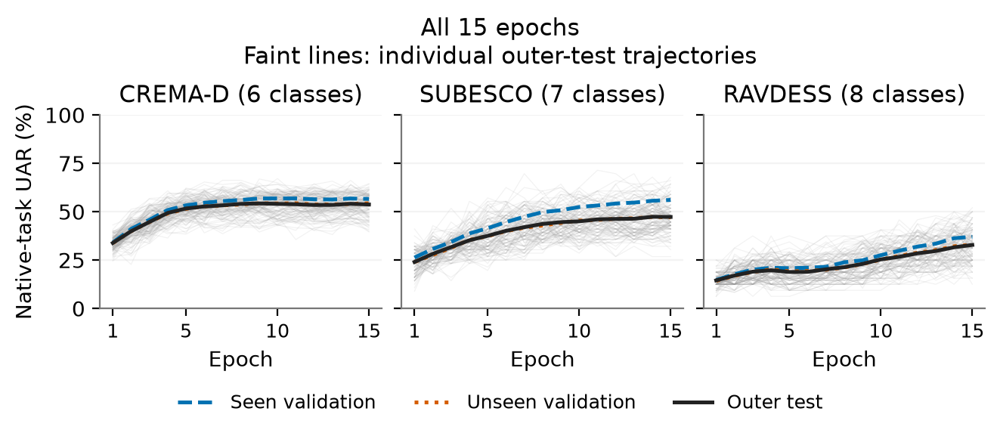

# 实验结论与论文取舍

这轮有价值的结论是：**“用没见过的说话人做验证”不自动等于“能挑出外测更好的模型”；还要看用什么指标挑模型。** 新程序应成为论文主线。它比只展示随机划分与说话人独立划分的成绩差更具体，但没有证明语言或声纹的单一机制，也没有造出能消除差距的数据集。

## 这次具体做了什么

主比较共 360 次训练：CREMA-D、SUBESCO、RAVDESS 各 24 次完整随机化，每次五折。每条轨迹都训练 15 轮，并保存每轮预测。对于同一条轨迹，分别让“训练见过的人”和“训练没见过的人”的验证集，用交叉熵 CE 或 UAR 挑一次检查点，共四条规则。最后把四个检查点放到**同一份未知说话人外测集**上比较。这样看到的是选模规则的后果，而不是重新训练四次造成的差异。

CE 看模型给真实类别的概率，UAR 看各情绪类别的召回率。两者衡量的东西不同，未必会挑中同一轮。验证集换人还会换录音与人群组成，因此实验没有把一个人的纯声纹作用独立出来。

第二部分增加 24 次 CREMA-D 训练：把训练人群 A 整组换成 B，匹配训练条数、文本/类别/性别槽位及种子；固定用第 15 轮，比较模型在两组查询上的表现。这是整组替换的描述性对照，不做额外显著性检验。

## 得到了什么

下面的正数表示“已见说话人验证”选出的模型在共同外测上更好；单位为 UAR 百分点。区间为 24 个完整 draw 的逐项 95% t 区间；六个预定检验共同做 Holm 校正。

| 语料 | CE 选模：已见减未见 | 95% 区间 | Holm p | CE 与 UAR 的曝光差之差 J | Holm p |
|---|---:|---|---:|---:|---:|
| CREMA-D | +0.935 | [0.287, 1.583] | 0.0264 | +0.937 | 0.0413 |
| SUBESCO | +2.247 | [0.945, 3.549] | 0.0083 | +2.560 | 0.0083 |
| RAVDESS | +0.486 | [-0.198, 1.170] | 0.3098 | +0.469 | 0.3877 |

前两库支持 CE 规则下的已见验证优势及准则交互；RAVDESS 还不能下非零结论。CREMA-D 的点估计不到 1 个百分点，SUBESCO 虽超过 1，但其区间下限也未超过 1，不能宣传成已证明至少 1 个百分点的收益。

改用 UAR 挑检查点后，三库的“已见减未见”描述均值为 −0.002、−0.313、+0.017 个百分点。这些均值很小，**不等于已经证明两种方式等效**。UAR 选择的绝对成绩在前两库较高，RAVDESS 则是 CE 较高，因此也不能推荐“任何语料都用 UAR 就最好”。

完整曲线限制了早先的解释：CREMA-D 整体趋于平台，SUBESCO 与 RAVDESS 的平均外测在后段仍提高，不能统一讲成“后期都崩了，某个验证集避免了崩坏”。这些曲线也没有证明校准失配是原因。

24 组人群替换的 E 均值为 **+2.828 个百分点**，其中仍有一个反向配对。它描述模型平均在自己训练人群的查询上更有优势；不能当成逐人声纹因果效果，也不能说明 CE/UAR 交互由此引起。全部 24 个值、全轮次分布和完整六项区间见[完整科学解读](review/FINAL_SCIENCE_INTERPRETATION.md)。

## 哪些放入论文

| 研究 | 取舍及理由 |
|---|---|
| 新 360 次共同轨迹选模比较 | 主文中心；完整保留三库、六个检验、四规则和末轮绝对成绩。增量是直接测共同外测上的选模后果及准则交互。 |
| 新 24 次整组互换 | 主文短段、完整报告保留所有点；补充描述人物曝光，不能升级成机制证明。 |
| N14R2、DUAL 和事后诊断 | 作为前导与估计对象区分。旧 1.419/2.706 是验证乐观差，不是本轮外测损失；既有预测再分析不算独立重复。 |
| 固定录音预算的 Study II | 讨论数据组织边界；人数与每人文本覆盖同时变化，提供真实可复用配置清单，不称最优数据集。 |
| E2 声纹覆盖选样 | 保留未检出主收益的结果；改善池内几何代理不保证外测收益，也不证明所有覆盖策略无用。 |
| TTS 技术探针 | 只记可行性边界。正式 E3 未满足条件准入、未执行；人评是 0/3 未完成，不是三人都否定。不能写成正式合成训练无效。 |

我的判断是：相比旧稿，新稿的问题更清楚、对照更直接、证据更完整，适合定位为评估方法的实证研究。创新来自明确的受控比较与结果，不来自训练次数、三个语料或审计工具。仍只有一个固定 WavLM 配置，三库是已接触的表演语料，预算与原生类别不同；这限制普适性与机制主张。不能据此保证录用或宣称全球首次。

## 算力、验收与云服务器

384 次正式训练全部在本机 RTX 5070 完成，训练失败和重试为 0。单元 wall 合计 **4.783 小时**，包括规定评估、保存及单元恢复；原进程起止观察跨度 **4.868 小时**，两者不是同一种计时。批次更新尝试 110,160 次，AMP 记录跳过 44 次。逐收据最大 PyTorch allocated 为 1.653 GiB、reserved 为 8.555 GiB，不能把 allocated 当设备总显存需求。

AutoDL 已实际尝试：已有 token 有效，但创建实例被 `TORealName` 实名认证要求拒绝，本次没有在 AutoDL 上训练。已有本地结果完成后，再迁移重跑不能加快这批实验交付。此次没有 AutoDL 实例的实际训练计时或账单，不能拿本地耗时冒充云端实测。

全部工件、检查点和账本核验通过；独立复算比较 63,901 个数值，无不匹配。预定四个单元在新进程中恢复，30 组预测比较最大差为 0。第一次恢复因启动环境变量错误失败，修正后接续，原失败保留；这不是训练失败。预测包已在新目录解包并复算通过，但不含音频、基座或检查点，不能宣传成完整重训复现。详细证据见[归档入口](../../v3/final_program_20260907/reports/README.md)。

英文和中文论文以同一份未舍入结果为事实源，正文采用一致展示精度；没有因结果方向追加训练、删库或更换主要终点。实际投稿前仍需作者审核和提供真实投稿信息，本任务不代为提交会议。
