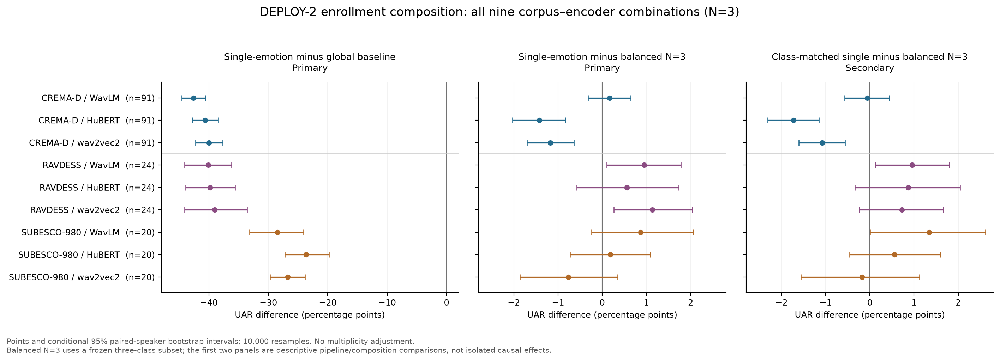

# DEPLOY-2 模块 A：完整九组合结果解读

冻结源码未修改，正式 A 的135单元全部进入评分；无先导数据。输出903项预定终点（含6项不可用）及858项绝对条件/估计器量。独立实现已完成51,150项数值比较，0失败。

主要结果是：只有3条登记参照时，朴素逐人归一化本身出现大幅退化；balanced与single都比全局标准化明显低。single相对balanced的额外差异小得多，且方向依语料和编码器变化。因此不能把全部下降解释为情绪组成偏斜。

## N=3 主结果：全部九个语料×编码器组合

绝对UAR以0–100计；差值以UAR百分点计。方括号为冻结的95%配对说话人bootstrap条件性区间。single绝对值为已冻结差值加基线的描述性点估计，无新计算区间。

| 语料 / 编码器 | 全局基线UAR | balanced UAR | single UAR | single−全局 | single−balanced |
|---|---:|---:|---:|---:|---:|
| CREMA-D / WavLM | 70.36 | 27.57 | 27.74 | -42.62 [-44.54, -40.59] | 0.17 [-0.32, 0.65] |
| CREMA-D / HuBERT | 69.00 | 29.77 | 28.35 | -40.65 [-42.78, -38.45] | -1.42 [-2.03, -0.83] |
| CREMA-D / wav2vec2 | 64.36 | 25.57 | 24.39 | -39.96 [-42.23, -37.67] | -1.18 [-1.70, -0.64] |
| RAVDESS / WavLM | 57.86 | 16.81 | 17.75 | -40.10 [-44.08, -36.17] | 0.95 [0.11, 1.78] |
| RAVDESS / HuBERT | 57.86 | 17.52 | 18.08 | -39.78 [-43.90, -35.61] | 0.56 [-0.58, 1.73] |
| RAVDESS / wav2vec2 | 56.47 | 16.28 | 17.41 | -39.06 [-44.11, -33.56] | 1.14 [0.26, 2.03] |
| SUBESCO-980 / WavLM | 47.94 | 18.60 | 19.47 | -28.46 [-33.14, -24.09] | 0.87 [-0.24, 2.06] |
| SUBESCO-980 / HuBERT | 43.10 | 19.25 | 19.44 | -23.66 [-27.24, -19.81] | 0.19 [-0.73, 1.08] |
| SUBESCO-980 / wav2vec2 | 44.76 | 18.78 | 18.01 | -26.75 [-29.70, -23.84] | -0.76 [-1.86, 0.35] |

balanced@3固定包含三个预定类别，而主single量在全部可行情绪间等权。下表保留类别平均比例匹配的次要对比；不能用其结果替换主量。

| 语料 / 编码器 | 类别匹配single−balanced（次要） | 参照情绪自身召回变化（主量） |
|---|---:|---:|
| CREMA-D / WavLM | -0.06 [-0.57, 0.44] | -53.32 [-55.53, -51.06] |
| CREMA-D / HuBERT | -1.73 [-2.31, -1.15] | -51.63 [-54.04, -49.19] |
| CREMA-D / wav2vec2 | -1.08 [-1.61, -0.56] | -47.51 [-50.03, -45.01] |
| RAVDESS / WavLM | 0.96 [0.12, 1.80] | -47.29 [-51.32, -43.39] |
| RAVDESS / HuBERT | 0.87 [-0.34, 2.04] | -45.77 [-50.25, -41.26] |
| RAVDESS / wav2vec2 | 0.73 [-0.24, 1.66] | -44.49 [-50.03, -38.85] |
| SUBESCO-980 / WavLM | 1.34 [0.01, 2.62] | -32.95 [-38.81, -27.76] |
| SUBESCO-980 / HuBERT | 0.56 [-0.46, 1.59] | -27.52 [-32.00, -22.73] |
| SUBESCO-980 / wav2vec2 | -0.17 [-1.56, 1.13] | -30.10 [-33.44, -26.79] |

## 估计器挽回：全部九组合

以下均为single N3下E2/E3/E4相对朴素E1的UAR百分点差，并非相对全局基线的收益。三种方法都挽回部分退化。E2相对全局基线的描述性点估计在九组合中仍为负，范围约−0.85至−5.18点；未对此新增区间或假设检验。

| 语料 / 编码器 | E2 shrink−E1 | E3 neutral_filter−E1 | E4 prior_corrected−E1 |
|---|---:|---:|---:|
| CREMA-D / WavLM | 40.54 [38.71, 42.35] | 33.13 [31.92, 34.34] | 39.54 [37.90, 41.15] |
| CREMA-D / HuBERT | 39.80 [37.78, 41.78] | 33.07 [31.69, 34.45] | 39.24 [37.41, 41.09] |
| CREMA-D / wav2vec2 | 38.26 [36.33, 40.14] | 31.01 [29.67, 32.32] | 36.94 [35.16, 38.68] |
| RAVDESS / WavLM | 36.87 [33.53, 40.18] | 26.69 [24.00, 29.49] | 29.53 [26.56, 32.59] |
| RAVDESS / HuBERT | 34.60 [30.51, 38.59] | 26.32 [23.41, 29.28] | 28.24 [25.12, 31.47] |
| RAVDESS / wav2vec2 | 34.18 [29.92, 38.30] | 26.11 [23.22, 29.00] | 28.29 [24.73, 31.76] |
| SUBESCO-980 / WavLM | 24.74 [21.95, 27.51] | 17.15 [15.24, 19.08] | 21.32 [19.24, 23.35] |
| SUBESCO-980 / HuBERT | 19.61 [16.68, 22.36] | 13.86 [11.87, 15.70] | 16.36 [14.11, 18.41] |
| SUBESCO-980 / wav2vec2 | 22.43 [19.13, 25.40] | 17.24 [14.84, 19.44] | 19.60 [16.81, 22.39] |

## 本人/异人对比与受害比例

朴素single N3相对全局基线降低超过2点的逐人受害比例，九组合均为100%，其经验bootstrap区间也为[100%,100%]。这是每人先平均抽样、重复划分和参照情绪后的指示，不是每条语音或每次抽样都变差。异人对比按固定一一错排并复用供给者的同一参照抽样。

| 语料 / 编码器 | 异人balanced−本人balanced | 异人single−本人single | E2受害比例%（次要） | E3受害比例%（次要） | E4受害比例%（次要） |
|---|---:|---:|---:|---:|---:|
| CREMA-D / WavLM | -0.42 [-1.13, 0.27] | -0.68 [-1.02, -0.35] | 49.5 [39.6, 59.3] | 89.0 [82.4, 94.5] | 60.4 [50.5, 70.3] |
| CREMA-D / HuBERT | -1.80 [-2.51, -1.10] | -1.33 [-1.63, -1.01] | 41.8 [31.9, 51.6] | 84.6 [76.9, 91.2] | 40.7 [30.8, 50.5] |
| CREMA-D / wav2vec2 | -1.75 [-2.41, -1.10] | -1.21 [-1.54, -0.90] | 56.0 [46.2, 65.9] | 80.2 [72.5, 87.9] | 60.4 [50.5, 70.3] |
| RAVDESS / WavLM | 0.03 [-1.02, 1.08] | -0.86 [-1.43, -0.30] | 70.8 [50.0, 87.5] | 91.7 [79.2, 100.0] | 91.7 [79.2, 100.0] |
| RAVDESS / HuBERT | -0.13 [-1.26, 0.97] | -0.39 [-1.11, 0.41] | 79.2 [62.5, 95.8] | 95.8 [87.5, 100.0] | 91.7 [79.2, 100.0] |
| RAVDESS / wav2vec2 | 0.20 [-1.02, 1.45] | -0.62 [-1.30, 0.14] | 62.5 [41.7, 79.2] | 91.7 [79.2, 100.0] | 83.3 [66.7, 95.8] |
| SUBESCO-980 / WavLM | 0.33 [-1.08, 1.78] | -0.02 [-0.83, 0.83] | 55.0 [35.0, 75.0] | 95.0 [85.0, 100.0] | 65.0 [45.0, 85.0] |
| SUBESCO-980 / HuBERT | -0.57 [-1.65, 0.62] | -1.24 [-2.09, -0.40] | 70.0 [50.0, 90.0] | 90.0 [75.0, 100.0] | 80.0 [60.0, 95.0] |
| SUBESCO-980 / wav2vec2 | -0.90 [-2.46, 0.73] | 0.21 [-0.39, 0.79] | 55.0 [35.0, 75.0] | 90.0 [75.0, 100.0] | 90.0 [75.0, 100.0] |

## N=5 次要结果：不可行组合保留NA

| 语料 / 编码器 | balanced UAR | single−全局 | single−balanced | 朴素single受害比例% |
|---|---:|---:|---:|---:|
| CREMA-D / WavLM | 41.39 | -31.00 [-32.72, -29.19] | -2.03 [-2.54, -1.51] | 100.0 [100.0, 100.0] |
| CREMA-D / HuBERT | 46.58 | -26.31 [-27.98, -24.58] | -3.89 [-4.61, -3.19] | 98.9 [96.7, 100.0] |
| CREMA-D / wav2vec2 | 39.49 | -28.57 [-30.55, -26.55] | -3.70 [-4.45, -2.96] | 100.0 [100.0, 100.0] |
| RAVDESS / WavLM | 21.06 | NA | NA | NA |
| RAVDESS / HuBERT | 23.81 | NA | NA | NA |
| RAVDESS / wav2vec2 | 25.79 | NA | NA | NA |
| SUBESCO-980 / WavLM | 23.95 | NA | NA | NA |
| SUBESCO-980 / HuBERT | 24.46 | NA | NA | NA |
| SUBESCO-980 / wav2vec2 | 24.86 | NA | NA | NA |

CREMA-D三编码器的single−balanced N5差值分别约−2.03、−3.89、−3.70点（按WavLM、HuBERT、wav2vec2顺序），其区间均在零以下。它是预定次要结果，不能升级替代N3主量。RAVDESS与SUBESCO-980没有任何类别可为每人提供5条单情绪登记，故不生成虚构single N5结果。RAVDESS的neutral N3也不可行。全部32个不可行语料/条件对及具体原因保留于endpoints.json的feasibility和summary_all9.json。

## 解释边界与文件

E0全局标准化与E1–E4逐人归一化对应分别训练的Ridge管线；两者差值不能当成固定模型权重下只改变一次测试变换的因果效应。当前实验没有单独操纵均值估计与方差估计，不能把整体失稳进一步归因于某个具体机制。已有结果暴露、条件性区间、无多重比较校正以及受控表演语料局限均保持披露。oracle_all使用Q特征且不可部署，不是保证上界；其点估计在RAVDESS和SUBESCO三编码器中仍低于全局基线。

- `endpoints.json`：冻结评分器完整903终点、858绝对量、可行性及输入散列。
- `per_speaker.csv`、`harm_share.csv`、`recall.csv`：完整逐人、受害及逐类召回输出。
- `summary_all9.json`：全部九组合的主量、N5次量、绝对量及边界说明；不替代原始全表。
- `primary_N3.csv`、`N5.csv`：便于总体报告/作图的固定九组合表；分别与`primary_all9.csv`、`secondary_N5_all9.csv`内容完全相同。空白为不可行NA，不是零。
- `primary_N3_forest.png`、`primary_N3_forest.svg`：全部九组合的两个主对比与类别匹配次要对比；已完成视觉核查。
- `../../evidence/analysis_verification_A.json`：独立正式复算验收收据。
