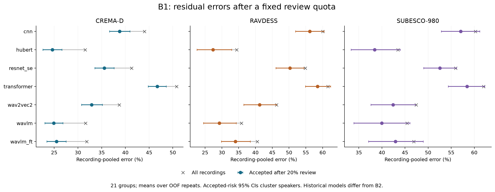
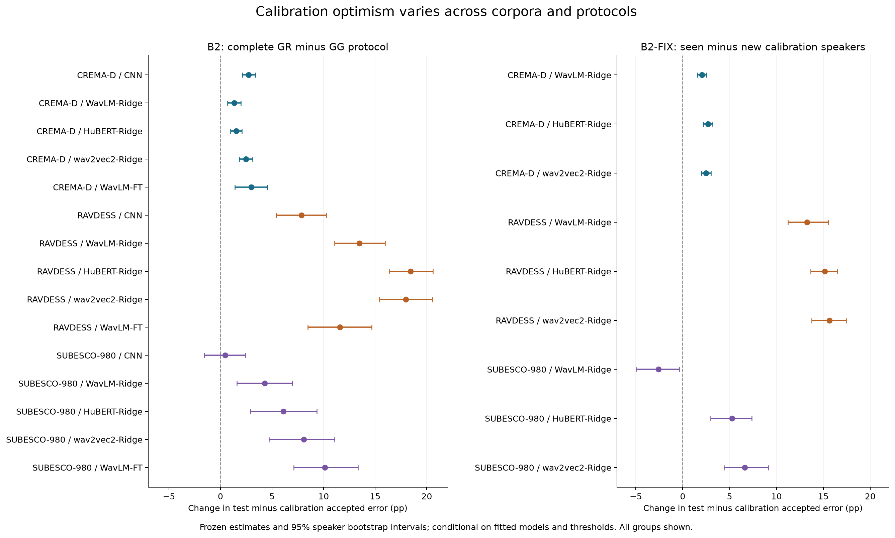

# SER26-DEPLOY-2：完整实验结果与论文解读

分析日期：2026-09-05。全部计算已完成，GPU已停止；本轮评分、复算和作图均在本地CPU完成。

**当前最有依据的论文结论是：校准集上的风险估计可能过于乐观，固定复核额度也不能保证每个人获得相近的自动处理覆盖。** 小样本登记实验显示明显退化，但不支持把这种退化统一归因于单一情绪参照。结果存在语料与模型差异，下面保留反向结果及不可行条件。

## 1. 完整性和独立核验

|模块|输入范围|预定终点数|核验结果|
|---|---|---:|---|
|A：登记参照|135新单元；3语料×3编码器|903，含6项不可用|冻结独立复算51,150项比较通过|
|B1：固定人工复核额度|360旧GG预测单元；72个五折OOF重复；21组|84，另保留全部预算及逐折敏感性|冻结验收失败；完整独立补充验收426,972项比较通过|
|B2：GR/GG完整管线|390新单元；15组；270 Ridge、90 CNN、30 FT|105|冻结独立复算17,595项比较通过|
|B2-FIX：固定模型校准|135新Ridge单元；9组|36|冻结独立复算22,158项比较通过|

共保留1,128项预定终点，含次要结果和不可用条目；它们不是1,128次互相独立的验证试验。A/B2/FIX共660个新计算单元，重复使用同一批说话人，不能把单元数当成统计样本数。全部120个GPU检查点已在本地，B2复核包含其SHA校验。

**原始冻结 `all` 验收状态仍为 FAIL，未改写成 PASS。** B1有两个已查明问题：原 `summary.csv` 以首个六类语料确定列名，遗漏后续语料的类别6/7支持列；冻结验证器对某个逐人风险使用跳过缺失的平均，主评分器与规范要求任何重复无接受时保留NA。具体为SUBESCO/CNN、30%预算、F09：九个重复中一次49条全部被拒绝，风险仅8/9次可定义。

原CSV、评分源码、训练数据、模型和预定终点均未修改。新增完整列导出，并由独立实现从原始预测完整核查全局与逐折终点、汇总、逐人风险、类别组成、72个逐重复来源及补充表；主评分中的严格NA符合规范。因此可以使用核验后的描述性结果，但须同时保留原冻结失败和补充通过记录。这不是训练失败，也没有据此挑选或重跑模型。

额外逐字段核查A类别召回/主次导出及B2全部390行阈值/风险导出，17,328项比较通过。核验记录：[综合验收](../evidence/analysis_verification_summary.json)、[原冻结全部模块](../evidence/analysis_verification_all_frozen.json)、[B1独立补充核验](../evidence/analysis_verification_B1_supplemental.json)。

## 2. A：主要是少量参照下的管线退化，情绪组成效应较小且不一致

N=3主设置中，朴素单情绪登记相对全局标准化，九组UAR均下降，幅度为23.66–42.62个百分点；balanced登记同样有大幅下降。单情绪相对balanced的额外差异仅为−1.42至+1.14点，正负均有，不能把约24–43点的总下降都解释成“情绪偏斜”。

|语料|WavLM：single−balanced|HuBERT：single−balanced|wav2vec2：single−balanced|
|---|---:|---:|---:|
|CREMA-D|+0.17 [−0.32,+0.65]|−1.42 [−2.03,−0.83]|−1.18 [−1.70,−0.64]|
|RAVDESS|+0.95 [+0.11,+1.78]|+0.56 [−0.58,+1.73]|+1.14 [+0.26,+2.03]|
|SUBESCO-980|+0.87 [−0.24,+2.06]|+0.19 [−0.73,+1.08]|−0.76 [−1.86,+0.35]|

单位为UAR百分点，括号为冻结95%配对说话人bootstrap区间。主single量平均全部可行情绪，balanced@3使用固定三个类别；类别比例匹配的预定次要对比也已保留，仍不支持普遍同向的大幅组成效应。

E2收缩估计相对朴素single挽回19.61–40.54点，但其相对全局基线的派生点估计仍低0.85–5.18点。“缓解退化”不能写成“超过全局方法”；这里也没有新增E2−全局的区间或估计器排名检验。

N=5次要设置中，仅CREMA-D的single条件对所有人可行，single−balanced分别为−2.03、−3.89、−3.70点（WavLM、HuBERT、wav2vec2），可以报告为局部、预定次要证据。RAVDESS和SUBESCO的single N5不可行，保留NA；RAVDESS neutral N3亦不可行。E0与E1–E4是分别训练的Ridge管线，不能把其差值当成固定权重下只改变测试标准化的纯因果效应，也不能据此单独确定均值或方差估计的机制。

[A完整解读与全部估计器/次要结果](A/ANALYSIS_ZH.md) · [N3主表](A/primary_N3.csv) · [N5表](A/N5.csv)

## 3. B1：20%人工复核有作用，但剩余错误和逐人覆盖仍需报告

完整21组中，复核最低置信度约20%的录音，捕获原始错误的23.97%–37.48%；仍有62.52%–76.03%的原始错误留在自动接受部分。接受集的录音池化错误率为24.62%–58.48%，各组都低于各自未筛选时的错误率，但不能据此称自动处理已经可靠。

总体接受约80%不意味着每人接受80%。每次重复中，覆盖不足70%的说话人平均占4.03%–25.00%。20%主预算没有零接受的人；30%次要预算存在前述一例零接受，因此保留其风险NA。

逐折分配同一名义复核比例时，21组的低覆盖人数均减少或持平，池化错误率与全局OOF排序的最大差仅0.49个百分点。这说明只看总体风险可能掩盖覆盖分配的变化。逐折floor造成的实际总额度差异已保留；这不是严格等额的独立因果比较。

这是对完整待处理批次按置信度排序的分析，不是陌生人在线阈值部署保证。不同模型的预测来自历史v2设置，不能与新B2模型直接相减后归因于模型结构。

[B1全部21组、三档预算及覆盖/AURC解读](B1/B1_ANALYSIS_ZH.md) · [20%主表](B1/primary_budget20_complete.csv) · [完整预算表](B1/summary_complete.csv)

## 4. B2/FIX：风险低估更有依据；不能写成测试性能必然恶化

这里的“风险gap”是**测试接受错误率−校准接受错误率**。对两协议比较gap，正值意味着前者相对更加乐观，不等于测试错误本身增加同样多。

B2完整GR−GG对照的15组gap差点估计全部为正，范围+0.44至+18.44点；SUBESCO/CNN区间跨零。测试接受错误差却正负均有，范围−9.03至+2.49点。由于GR/GG同时改变训练集合，不能从B2独自断言是校准重叠的纯作用。

B2-FIX保持同一模型、标准化器和测试logits，更换录音数量及句子×类别支持匹配的seen/new校准集，得到以下全部九组：

|语料|WavLM-Ridge gap差|HuBERT-Ridge gap差|wav2vec2-Ridge gap差|
|---|---:|---:|---:|
|CREMA-D|+2.04 [+1.57,+2.52]|+2.70 [+2.21,+3.20]|+2.48 [+1.97,+3.00]|
|RAVDESS|+13.27 [+11.22,+15.54]|+15.14 [+13.66,+16.52]|+15.63 [+13.75,+17.45]|
|SUBESCO-980|−2.59 [−4.96,−0.38]|+5.25 [+2.99,+7.38]|+6.63 [+4.40,+9.12]|

单位为百分点；seen−new，95%条件性配对区间。8/9组正向，**SUBESCO/WavLM为明确反向例外**。因此应写成受语料与编码器影响的校准乐观偏差，不能写成所有语料、所有模型的必然规律。

RAVDESS三种Ridge的gap增加13.27–15.63点，而测试接受错误仅增加0.16–0.88点。这个区别是论文最需要讲清楚的：改变校准人群主要改变了对部署风险的判断，测试识别性能未出现同等量级的变化。FIX只覆盖Ridge，不能把同样的隔离结论延伸到CNN或微调模型。

主阈值按校准集20%置信度分位数设置，B2测试逐人平均实际复核率为15.44%–23.76%。次要风险阈值的接受覆盖最低仅6.63%；严格跨重复风险比较时，SUBESCO/HuBERT仅剩2/20人有完整定义。必须同时报告有效人数，不能把小部分获接受者的条件风险改善写成总体改善。

[B2/FIX全部主次表与解读](analysis/B2_ANALYSIS_ZH.md) · [B2全部15组](analysis/B2_primary_all15.csv) · [FIX全部9组](analysis/B2_FIX_primary_all9.csv)

## 5. 论文表述与下一步

建议围绕“登记、人工复核、校准这三个操作环节中，汇总性能如何偏离实际使用条件”组织结果。固定模型校准对照提供较直接证据，B1展示复核额度与剩余错误/覆盖的关系，A保留小样本登记的失败以及有限、异质的情绪组成结果。

不宜沿用“单情绪登记普遍导致大幅额外损失”“任一说话人重叠必然恶化测试性能”“收缩方法普遍超过全局基线”的强结论。当前数据不支持这些统一表述。已有完整结果足以进入论文结果部分，无需为完成本轮分析追加云端训练。任何看过本轮结果后再设计的机制实验，都应作为新的探索性阶段另行冻结，不回填成此次预定验证。

说话人bootstrap为10,000次，种子20260905。A/B2/FIX的逐人配对量先按各自冻结规则聚合同一人的抽样与重复，再以人配对抽样；B1的池化风险则在每次说话人重抽后分别汇总错误数与接受数、重新求比，再平均重复，不是逐人风险的等权平均。区间条件于这些固定模型和阈值，未包含重训与重新校准的全部不确定性。CREMA-D为91人、RAVDESS为24人、SUBESCO为20人；FT在B2只有一次五折重复。三者是受控表演语料，并且已有前期结果暴露，当前分析定位为估计与描述；不把多端点未校正区间包装成未经观察的验证性显著结论。

完整机器输出：[全部1,128项终点](analysis/all_1128_endpoints.csv)。分析展示脚本：[build_summary.py](../analysis/build_summary.py)。冻结身份：`d0ea238`，执行锁SHA `16a2045f637175961bd07dc83a84315f5940708eba87fc96889219aff15e4ad5`。该脚本仅导出表格、图和文字，不训练、不选择终点、不修改原始分数。
