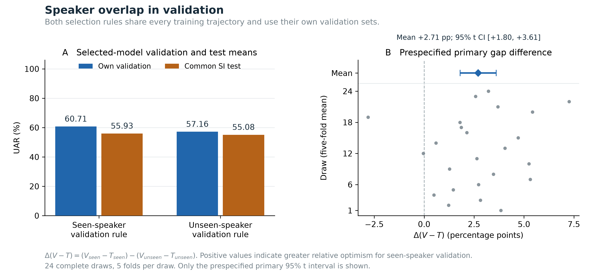
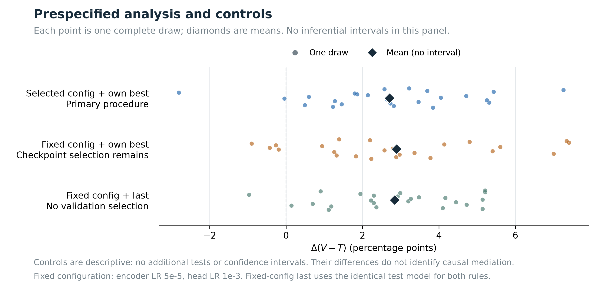

# WavLM 共同拟合轨迹下的验证说话人曝光：完成报告

**2026-09-07解释更新：**主θ应读作“不同验证说话人曝光下，所选模型的验证−SI外测差异”，不能全部称为选模导致的偏差。固定cfg3/第15轮的同模型验证差已为2.839 pp。原主终点、数值和确认性身份不变；新增[角色随机化、人物固定效应与检查点选择复核](../../review_response_20260907/dual_science_review.md)全部标为事后探索，见[Claude评审回应](../../review_response_20260907/RESPONSE.md)。

实验：`SER26-DUAL-VALIDATION-1`。日期：2026-09-07，以下时间均为 UTC。已完成 **480 次正式训练和 4 次独立技术试运行**；试运行不参与科学统计。完整性检查、冻结评分程序及独立数值复算全部通过，GPU 已停止。

## 1. 本轮得到什么结果

在本次固定 CREMA-D 语料和 WavLM 微调流程中，两种验证规则共享每一条候选训练轨迹。已见训练说话人的验证规则，相对共同说话人独立外测的乐观偏差，平均比未见说话人规则高 **2.706 个百分点**；95% t 区间为 **[1.802, 3.610]**，双侧 **p = 2.556 × 10⁻⁶**。

这里衡量的是验证分数对外测表现的相对乐观程度，定义为：

`θ = mean_draw(mean_fold[(V_seen − T_seen) − (V_unseen − T_unseen)])`

V 是各自用于选模的验证 UAR，T 是其选中模型在共同外测上的 UAR。两种规则共用候选拟合过程和外测录音，最后选中的配置和训练轮次可以不同。

| 主流程 | 验证 UAR (%) | 外测 UAR (%) | 验证 − 外测 (pp) |
|---|---:|---:|---:|
| 已见说话人验证规则 | 60.712 | 55.930 | 4.782 |
| 未见说话人验证规则 | 57.159 | 55.083 | 2.076 |

验证差 **ΔV = +3.553 pp**，外测差 **ΔT = +0.847 pp**，因此 **θ = 3.553 − 0.847 = 2.706 pp**。未见说话人规则的平均验证乐观差距较小，但外测点估计也较低。原冻结分析将ΔT列为描述性分解，没有为它预定推断检验；下文另列审稿后补算的探索区间。不能将该补算提升为原预定结论，更不能把θ写成外测准确率下降。

统计单位是 **24 次预定随机划分**，每次先等权平均五折，再等权平均 24 次。UAR 为每折全部录音的六类宏平均召回率，不是逐人 UAR，也不是将全部折录音合并计算。主效应的划分间 SD 为 2.140 pp、SE 为 0.437 pp、t = 6.194、df = 23。唯一主检验采用双侧 t 检验；50,000 次整划分 bootstrap（PCG64，种子 2026090701）的敏感性区间为 **[1.857, 3.527] pp**，方向一致。没有把 480 次训练、120 个折面板或录音当作独立推断样本。



精确结果：[results.json](results/results.json)；全部划分：[draws.csv](results/draws.csv)。

## 2. 两个预定对照也完整报告

固定配置为 config 3：编码器学习率 5e-5、分类头学习率 1e-3。

| 流程 | V_seen (%) | V_unseen (%) | T_seen (%) | T_unseen (%) |
|---|---:|---:|---:|---:|
| 主流程：选择配置及各自最佳轮次 | 60.712 | 57.159 | 55.930 | 55.083 |
| 固定配置，各自最佳轮次 | 58.822 | 55.200 | 54.918 | 54.185 |
| 固定配置，第 15 轮 | 56.172 | 53.333 | 52.846 | 52.846 |

| 流程 | ΔV (pp) | ΔT (pp) | Δ(V−T) (pp) |
|---|---:|---:|---:|
| 主流程 | +3.553 | +0.847 | +2.706 |
| 固定配置，各自最佳轮次 | +3.623 | +0.732 | +2.890 |
| 固定配置，第 15 轮 | +2.839 | **0（精确相同模型）** | +2.839 |

固定第 15 轮时，两种验证人群评价的是同一模型，外测完全相同；此时观察到的平均差距直接来自两套验证分数之差。这说明本轮的平均差距并非只在适应性选模时出现。在原冻结分析中，两个对照均为描述性分析，没有对应的显著性检验或置信区间。

主流程减去“固定配置、第 15 轮”对照的描述性增量是 **−0.133 pp**。这个数不能写成“搜索放大偏差”，也不能写成“选模没有影响”或“二者等效”；它同时涉及配置与轮次选择，不识别纯超参数搜索或因果中介效应。

**审稿后补算，已独立核实：**以下区间均先按原口径在draw内平均五折，再由24个draw计算95% t区间；它们是事后探索、未经多重比较校正，不能替代唯一预定主检验θ。

| 事后检查 | 差值（pp） | 名义95% t区间 |
|---|---:|---:|
| 主选择程序的共同外测差：seen规则−unseen规则 | +0.847 | [+0.193, +1.501] |
| 固定cfg3，仅CE检查点选择规则不同的共同外测差 | +0.732 | [+0.271, +1.194] |
| 四配置等权平均，仅CE检查点选择规则不同的共同外测差 | **+0.836** | **[+0.570, +1.102]** |
| 固定cfg3、第15轮：unseen验证−共同外测 | **+0.487** | **[−0.196, +1.170]** |

四配置的仅检查点差分别为+0.664、+1.160、+0.786、+0.732 pp，平均为+0.836。它们共享划分、人物、文本和候选训练面板，**不是四次独立确认**。这条线索说明在本程序中，两种验证人群的CE选轮规则对应不同外测表现；没有完整逐轮外测存档，不能据此声称测试曲线在第8–10轮达峰，也不能推断“选更晚所以更好”。全部轨迹实际跑满15轮，比较的是检查点选择，不是提前停训。

固定cfg3、第15轮的+0.487，是同一模型在未见验证人和outer人的两次评估之差；不能与seen−unseen验证差+2.839混为一谈。其区间跨零仅表示本口径下未检出偏离，仍允许约1.17 pp的正差，不能写成“基本无偏”或已证明等效。它与主流程unseen gap 2.076的差同时涉及模型与验证分数选择，也不能全部归为选模复用偏差。精确数值与方法见[事后复核](../../review_response_20260907/dual_science_review.md)。

事后描述可进一步说明两种规则确实经常选出不同模型：120 个配对折面板中，仅 **34/120（28.33%）** 选择相同配置和轮次；其余 86 个至少有一项不同。配置 0/1/2/3 的选择次数分别为 seen **[7, 12, 62, 39]**、unseen **[20, 12, 52, 36]**。这些频数不增加任何推断检验，完整分布与输入哈希见 [selection_descriptives.json](selection_descriptives.json)。



## 3. 实际执行的设计

| 项目 | 固定内容 |
|---|---|
| 语料范围 | CREMA-D 清理后 7,435 条录音、91 名演员；沿用冻结的 MD/XX 代表录音规则 |
| 正式规模 | 24 次划分 × 5 折 × 4 配置 = 480 条实际训练轨迹，4 次技术 pilot 单独隔离 |
| 共同拟合集 | 每折 24 人（12 女、12 男）× 4 文本 × 6 情绪 = 576 条录音 |
| seen 验证 | 同一批拟合人物 × 2 个新查询文本 × 6 情绪 = 288 条 |
| unseen 验证 | 另外 24 人（12 女、12 男）× 同样 2 个查询文本 × 6 情绪 = 288 条 |
| 外测 | 本折全部留出人物在查询文本上的可用代表录音，每折 198–228 条；不补齐缺失录音 |
| 模型 | WavLM-base+，微调顶部 4 个 Transformer 层及六类线性分类头 |
| 训练 | 每条轨迹固定 15 轮，batch 16，AdamW，weight decay 0.01；训练裁剪 3 秒，评估上限 10 秒 |
| 四配置 | 编码器 LR {1e-5, 5e-5} × 分类头 LR {3e-4, 1e-3}；同面板候选配置共享预定训练种子 |
| 选轮次 | 每种规则按自身验证 CE 最小选择，精确并列取最早轮次 |
| 选配置 | 各自最佳轮次的自身验证 UAR 最大，精确并列取最低配置索引 |

各录音角色不重合；只有 seen 验证与拟合集共用人物。查询文本对梯度拟合未见，但已被验证用于选模，并与外测共用，不能称外测文本对整个开发流程完全未见。576 是拟合预算；加两套验证后，每个面板有 1,152 条不同开发录音，另有外测。类别平衡使本轮类别权重均为 1。

所有 120 个面板在训练前已通过容量和划分检查。模型使用固定公开基座，未复用旧实验的训练后权重；本轮无储备划分，无中途看分数决定续跑，也未因结果方向修改训练或选择规则。[冻结协议](../PROTOCOL.md)和[计划锁](../evidence/PLAN_LOCK.json)保留完整约束。

事后角色核查还确认，**91/91人**跨draw都进入过seen与unseen验证角色，不能将本研究描述成始终比较两组固定人物。cfg3按person/context等权、控制人物与joint(draw,fold)固定效应后的角色系数为 **+2.871 pp**，24个draw聚类CR1的事后95% t区间为 **[2.211, 3.531]**；先在person/context内平均四配置末轮后，系数为 **+2.899 pp**。这不支持“固定人物平均难度解释了全部差距”，但仍不能排除人物与模型、文本、曝光交互，或整个训练人群变化；它不是纯声纹记忆或逐人加入的因果证据。

## 4. 相比原论文，增加了什么证据

原 N14R2 的主结果是 **+1.419 pp，95% t CI [0.901, 1.937]**，来源为[完成版结果附件](https://github.com/DeerNeverStop/SER/releases/download/SER26-N14R2-complete-20260906/n14r2_results.metadata-corrected.json)及[报告附件](https://github.com/DeerNeverStop/SER/releases/download/SER26-N14R2-complete-20260906/REPORT.md)。该数也代表相对验证乐观差距，不能写成外测下降。

原实验以 ResNet-SE 从头训练，录音随机验证与人物分组验证各自重新划分 fit/val，1,920 次拟合。两臂共用 outer train/test，但拟合成员不同，拟合录音数量也不保证相同，见[原冻结划分代码](https://github.com/DeerNeverStop/SER/blob/4fe0bb52f15b56a6626363be31a378b0f9661293/v2_1/n14r2/plan.py#L158-L180)。

本轮最有价值的补充，是在 **共同拟合录音、共同候选训练轨迹、匹配验证预算和文本** 的条件下，用现代预训练语音编码器的微调流程，仍观察到正的相对乐观差距。因此，“本轮差异只是两臂用了不同拟合集”这一解释不适用于本轮。

适合放入论文的主线是：**验证说话人曝光会改变性能估计的乐观程度；更接近外测的验证估计，不必然带来更高的外测性能。** 这是一项有用的受控扩展，补强评估方法的实证贡献。它不是原 N14R2 random/grouped 25% 划分程序的等价复现；模型、拟合预算、训练时长和文本条件均不同，不能把 2.706 与 1.419 的差额归因于模型架构，也不能直接合并两项结果。

这些证据仍不足以证明纯声纹记忆机制、语言的因果作用、跨语料普适性、说话人总体效应，或“某个新数据集/AI 语音可以消除 SD–SI 差距”。本轮只用固定CREMA-D；24次划分反映固定语料和流程下的随机化变动，演员并非一批从未研究过的新总体。未见验证−外测的平均gap在**原自适应选择程序**中为2.076 pp，在**固定cfg3、第15轮**时为0.487 pp，后者的事后区间为[−0.196, 1.170]；两者都不能被直接写成无偏或部署保证。

同一批480条轨迹的后续[固定末轮交叉报告诊断](../../validation_reporting/REPORT.md)，得到相同方向定义的共同外测差 **−0.234 pp**，与本主程序的 **+0.847 pp** 点估计方向相反。前者只在四个末轮模型间选择，每个方向用12人/144条选模；本程序先按15轮CE选检查点，再用24人/288条的UAR选配置。轮次候选、选择预算与报告程序同时改变，所以不能将符号变化因果归于冻结轮次、说话人隔离或任何单一因素，也不能据此给出哪条规则普遍更好的部署建议。

对创新性的判断：这一实验增加的是**有控制条件的现代模型证据**，不是新模型架构或已验证的数据集解决方案。它比只增加重复次数更能补强原论文，但论文质量仍取决于问题定位、相关工作和适用边界，不能用显著性或训练次数代替创新性判断。本轮未启动语言、声纹相似度或生成语音实验。

## 5. 算力、时间与费用

实际使用 Runpod 一张 RTX 5090，观察费率 **USD 0.99/小时**。租用从 **00:08:39.625** 到服务商确认停止的 **05:46:34**，共 **5 小时 37 分 54.375 秒**；按该跨度估算 GPU 费用为 **USD 5.57545，约 5.58 美元**，低于本轮 15 美元的运算预算。

| 资源记录 | 正式 480 次 | 技术 pilot 4 次 |
|---|---:|---:|
| 单次 fit 区间累计 | 16,505.549 秒（约 4.585 小时） | 132.624 秒 |
| 尝试参数更新 | 259,200 | 2,160 |
| AMP 记录的跳过更新 | 134 | 3 |
| 未跳过更新 | 259,066 | 2,157 |
| PyTorch allocated 峰值 | 2,030,068,736 B（1.891 GiB） | 1,810,424,320 B（1.686 GiB） |
| 结果文件总量（该阶段全部运行合计） | 124.099 GB | 1.022 GB |

两阶段合计结果文件为 **125,120,551,663 字节（125.121 GB）**，保留在 `D:/SER-dual-validation-20260906/runs`；包括检查点、预测、history、receipt 和 DONE，不含基座、原音频、缓存、账本和审计附件。合计 fit 区间为 4 小时 37 分 18.174 秒，包含模型加载、训练、双验证、保存与重新加载推理，不能称纯 GPU 忙时。allocated 峰值不是 reserved、全进程显存或整卡显存。AMP 合计跳过 137/261,360 次尝试（约 0.0524%），15 轮训练均完整执行，未把跳过更新写成成功更新。

统一运行环境为 Python 3.12.3、PyTorch 2.8.0+cu128、CUDA 12.8、NumPy 2.1.2；训练 AMP float16，保存及评估权重 FP32；matmul TF32 关闭、cuDNN TF32 开启。资源定义及完整环境见[资源摘要](../evidence/completed/resource_summary.compact.json)和[原始资源 JSON 压缩件](../evidence/completed/resource_summary.json.gz)。

**费用估算不等于最终账单。** 05:47:59 查询时，该 Pod 已入账 GPU 费用 USD 4.63566、磁盘 USD 0.05394，共 USD 4.68959；最后返回的小时桶止于 05:00，尚有延迟。已入账 GPU 费用属于上述同一租期，不能再加到 5.57545 上。服务商按小时取整查询窗口，磁盘保留且单独计费；其他 Pod 费用未计入本报告。见[停卡收据](../evidence/completed/operations/stop.json)和[费用观测](../evidence/completed/operations/billing_at_completion.json)。

## 6. 结果如何核验，文件在哪里

完整训练账本中，formal 480 和 pilot 4 均只有一次 start/done，未记录 unit_failed；这不等于声称租用期间所有部署、传输或未留痕操作都零失败。60 批次各自退出码为 0；备份时逐文件校验，写入持久收据后才清理该批云端结果。最终云端和本地账本字节一致、无运行锁，关机前检查于 05:46:17 通过；05:46:34 确认 GPU 停止，本地调度器总扫描于 05:46:54 收尾。全部正式科学评分在停卡之后运行。

- **冻结身份**：科学源码提交 `de39f2ae5bad4540da9d13ab4cc6196bec786400`；计划语义 SHA256 `570cae10577e13bc17a5838d872251beeb52d8b216886d19a8dcb6418a7f5bbd`。最终独立检查确认 36/36 个冻结文件与计划、该 Git 提交逐字节相同，见[来源核对](../evidence/completed/operations/final_source_provenance.json)。该检查于 05:52:40 完成，记录当时的交付 HEAD `7bbe14b`；后续报告和附件提交不改变科学冻结身份。仓库为私有；这是预执行冻结，不是公开预注册。
- **完整结果检查**：[正式 gate](../evidence/completed/formal_gate.json)和[pilot gate](../evidence/completed/pilot_gate.json)通过。评分器接受的正式 gate 语义 SHA 为 `e289bf207279829c0b2f7f7f31bfb62265aaafe08d20081230952f47f173c956`。
- **模型恢复**：引擎对每次运行保存的唯一轮次均实际重新加载并复算。另对最初预定 4 次正式运行做独立进程恢复，共 36 组比较全部通过、最大误差 0，见[恢复收据](../evidence/completed/restore_first/summary.json)。这项独立进程检查只覆盖首 4 次，且共用架构及预处理，不是另一套训练实现或 480 次独立重训。
- **独立统计复算**：另一套聚合及 t/区间计算程序，从六类混淆矩阵重新形成 UAR、选模、五折与 24 次划分均值，复核三个 CSV 共 4,320 / 240 / 24 行及结果 JSON；共核对 **35,744 个数值**，最大绝对差 **1.421 × 10⁻¹⁴**，低于 1e-9 容差，见[复算记录](../evidence/completed/independent_replay.json)。它不调用主评分函数，但共享计划及完整性检查代码，因此证明的是数值与文件一致性。
- **软件检查**：试运行前云端 46 项科学程序合成测试通过；传输/调度、恢复/复算、资源汇总及本地编排另有分阶段合成测试。软件测试不替代上述真实运行和完整结果检查。
- **可审核附件**：[全部候选模型指标](results/pred_metrics.csv)、[240 条选模记录](results/selected_episodes.csv)、[24 次划分](results/draws.csv)、[精确结果](results/results.json)、PNG/SVG 图、60 批备份及清理收据均随 Git 提交。167 个完成附件的[文件哈希清单](../evidence/completed/FILE_SHA256.json)单独记录源路径与字节 SHA；该清单不包括后来撰写的本报告和事后选模描述。125.12 GB 原始模型与预测保留在 D 盘，不上传 Git。

基于已有完整归档复算时，使用保存的 `inputs/plan.json` 或解压 [plan.json.gz](../evidence/plan.json.gz) 的原字节，**不要重新生成计划来冒充本次执行**。在仓库根目录运行以下命令，输出指定到全新的目录：

```bash
python -m v3.inner_validation.run result-gate --repo . \
  --plan /archive/inputs/plan.json --outroot /archive/runs \
  --phase formal --out /new/formal_gate.json
python -m v3.inner_validation.score --repo . \
  --plan /archive/inputs/plan.json --outroot /archive/runs \
  --gate /new/formal_gate.json --out /new/scores
python -m v3.inner_validation.audit_tools.replay --repo . \
  --plan /archive/inputs/plan.json --outroot /archive/runs \
  --gate /new/formal_gate.json --results /new/scores --out /new/replay.json
```

本地实际命令、阶段时间、输出状态与启停收据绑定均保存在[pipeline.json](../evidence/completed/pipeline.json)。本报告是本轮实验的完成结果；[EXECUTION_STATUS.md](EXECUTION_STATUS.md)只保留最初 8 次完成时的历史快照。
