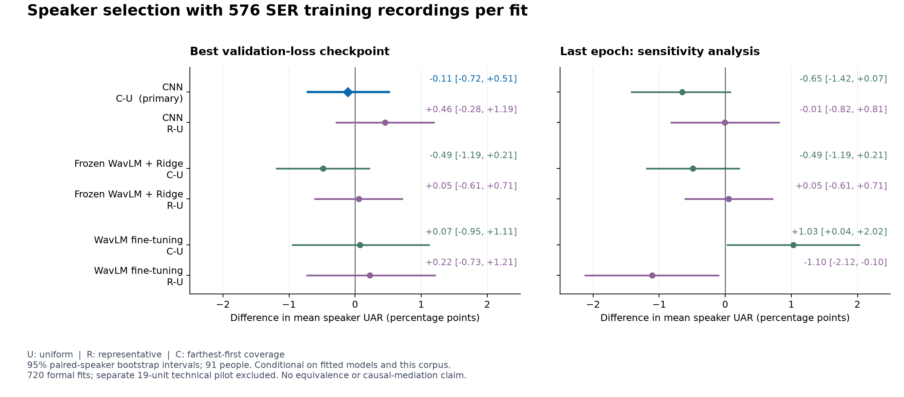

# 说话人选样实验：完成结果、可复核证据与论文判断

**2026-09-07解释更新：**收到Claude PR #16及后续评价后，将已独立核实的[外测声纹几何](../../review_response_20260907/e2_review_notes.md)直接纳入本报告：C使候选池内最坏NN1降低约9.60%，但同八文本参考下，真正外测人的平均NN1/NN3反而分别增加 **3.21%/3.43%**。因此“几何改善”仅指池内目标，不能暗示测试人已经更接近训练人，也不能据此因果解释SER结果。C具体是12F/12M配额的ECAPA farthest-first；原主终点与数值不变。本研究为私有仓库预执行冻结，不是公开预注册。完整处理见[评审回应](../../review_response_20260907/RESPONSE.md)。

本轮已完成 **720 次正式拟合和 19 次独立技术预跑**，完整结果核验、检查点恢复和独立数值复算均通过。2026-09-06 23:29:11 UTC 已确认云端 GPU 状态为 `EXITED`。

**主要发现：在本次固定 SER 训练录音数量的实验中，预定的声纹覆盖选人策略，没有在最佳验证检查点下表现出稳定的平均收益。** CNN 主比较 C−U 为 −0.109 个百分点，条件性 95% 区间为 [−0.715, +0.509]；WavLM 微调对应比较也接近零。这足以否定“本轮已成功证明覆盖选人有效”的写法，却不能证明所有覆盖策略无效、三策略等效，或说话人相关差距已经消除。

## 1. 正式结果

U 是按性别分层的均匀随机选人；R 用平均最近邻距离选择代表性人群；C 用性别配额约束下的逐步远点选择扩大声纹覆盖。三者每次均使用 24 人、576 条 SER 拟合录音。下表的 U/R/C 为等权个人 UAR（%）；差值及区间的单位为**百分点**，正值表示优于 U。

| 最佳验证检查点 | U | R | C | C−U，95% 条件区间 | R−U，95% 条件区间 |
|---|---:|---:|---:|---:|---:|
| CNN（C−U 为主比较） | 42.739 | 43.194 | 42.630 | −0.109 [−0.715, +0.509] | +0.456 [−0.284, +1.190] |
| 冻结 WavLM + Ridge | 28.209 | 28.263 | 27.721 | −0.487 [−1.187, +0.209] | +0.054 [−0.605, +0.715] |
| WavLM 微调 | 54.394 | 54.618 | 54.468 | +0.075 [−0.946, +1.114] | +0.225 [−0.728, +1.205] |

区间来自预定的 10,000 次**配对按人 bootstrap**，91 人等权；只反映在这些已拟合模型及这个语料条件下的人群重采样变化。共享训练集、少量训练种子、重叠 fold/rotation 的不确定性并未因此全部覆盖。720 次拟合不是 720 个独立统计样本。各区间为逐项区间，**没有作多重比较校正**，也没有执行等效性检验。

末轮检查点作为预设敏感性分析完整报告：CNN 的 C−U 为 −0.652 [−1.417, +0.074]，R−U 为 −0.006 [−0.818, +0.813]；WavLM 微调的 C−U 为 **+1.030 [+0.037, +2.024]**，R−U 为 **−1.104 [−2.118, −0.103]**。后两项名义区间不含零，但属于次要结果，不能替代最佳检查点主比较，也不能据此声称已验证策略与检查点的交互作用。Ridge 的 best/last 是同一组已拟合参数，两行相同不构成独立复现。

另一次审稿后复算得到，CNN 的末轮减 best 在 U/R/C 下分别为 **+1.366/+0.905/+0.823 pp**，三策略等权平均 **+1.032 pp**。这是同一完整100轮轨迹上的事后检查点比较，不能推出以后都应选择末轮。上述逐项名义区间并非同时置信区间，本报告没有据此作已控制多重比较的确认性结论，也没有将区间宽度反推的近似p值当作正式Holm结果。

CNN 主比较的三个 draw 分别为 +0.232、−0.903、+0.344；WavLM 最佳检查点的两个训练种子分别为 −0.194、+0.344。方向与大小存在变化。个人表现第 25 百分位也未显示一致改善：C 相比 U，CNN 为 37.037 对 36.111，WavLM 微调为 47.569 对 49.306。这只是各组分布分位数，不能当作“同一批最弱说话人”的配对收益或公平性结论。

完整可机读结果：[汇总 JSON](data/e2/results.json)、[策略均值](data/e2/policy_means.csv)、[全部比较](data/e2/contrasts.csv)、[按折描述](data/e2/fold_contrasts.csv)、[逐人结果](data/e2/per_speaker.csv)、[逐重复逐人结果](data/e2/per_repeat_speaker.csv)。[策略均值图](figures/e2_policy_means.png) 使用 0–100% 纵轴。

## 2. 本轮实际检验了什么

| 项目 | 执行内容 |
|---|---|
| 数据范围 | CREMA-D，清理后 7,435 条录音，91 位英语表演语音说话人，六类情绪 |
| 评估划分 | 5 folds × 6 个双查询句 rotation；SER 拟合、验证、测试说话人分离，查询句不进入训练或选人参考 |
| 拟合配额 | 每策略 24 人（12 女、12 男），每人 4 句 × 6 类，共 576 条；每个训练句覆盖人数和性别配额一致 |
| 验证 | 每 fold 固定 8 位验证人，按验证 loss 选择 best；训练完整 epoch，没有提前停止 |
| CNN | 270 次正式拟合；100 epochs、batch 32、学习率 0.001 |
| Ridge | 270 次正式拟合；冻结 WavLM 第 12 层特征、alpha=1、类平衡 LSQR，CPU 拟合 |
| WavLM 微调 | 180 次正式拟合；顶端 4 层及分类头、15 epochs、batch 16；编码器学习率 5e−5，头部 0.001；训练混合精度，推理 FP32 |
| 重复与统计 | CNN/Ridge 3 个 draw；微调固定 draw 0、2 个训练种子。先按人/类合并 6 个 rotation，再平均重复，最后等权平均人 |
| 独立技术预跑 | CNN 9 + Ridge 9 + 微调 1，共 19；排除于正式科学评分之外 |

选人、句子布局和分析规则在新的 SER 科学成绩解封前冻结。R/C 在同一 fold/rotation 的三个 draw 中保持选人集合固定；变化的是句子布局及 CNN 种子，U 还会变化所选人群。因此不能把 R/C 的三个 draw 描述为三组独立选人复现。

**预算边界需要明确：576 是分类器拟合录音数，不是全流程采集、信息或计算预算。** R/C 还使用候选池每人 8 条合法训练范围内的中性参考、预训练 ECAPA，以及身份、性别、句子和情绪标签等元数据。U 的选样规则本身不需要 ASV。部分参考与拟合录音重叠，不能简单相加。本轮比较的是具有这些前提的选样策略总效果，不能宣称它们在相同总数据获取成本下竞争。

录音条数相同也不等于时长或声音条件相同。CNN/Ridge 核心面板（每策略 90 个）的 U/R/C 平均原始总时长约 24.644/24.624/24.251 分钟，C−U 平均 −23.555 秒；微调使用 draw 0 的每策略 30 个面板，对应差值为 −27.015 秒。没有进行时长匹配。RMS 与振幅极值比例只是描述量，不等于信噪比或听觉质量。完整边界见[选样审计](SELECTION_AUDIT.md)、[时长与振幅审计](AUDIO_BUDGET_AUDIT.md)及[冻结方案](../EXECUTION_PLAN.md)。

## 3. 声纹机制、语言与合成数据的判断

E0 显示选人确实改变了声纹几何。C的冻结方向是候选池内**最大NN1**，不是平均NN1/NN3，也没有全局最优保证。90个配对视图中，池内最大NN1的均值由U的 **0.770476** 降至C的 **0.696548**，降低约 **9.60%**，90/90视图都降低；R为 **0.657004**，在87/90视图还低于C。这支持“该策略改善了自己的池内最坏距离”，不能推广为改善所有几何指标。

审稿后直接检查真正的outer-test人，得到不同的结果。下表使用同一ECAPA空间、相同八个允许训练文本的中性参考，距离越小越近：

| 外测指标，每视图等权 | U | R | C | C相对U |
|---|---:|---:|---:|---:|
| 平均最近一人距离（NN1） | 0.584055 | 0.574814 | 0.602815 | **增加3.21%** |
| 最近三人距离的平均值（NN3） | 0.645780 | 0.640656 | 0.667936 | **增加3.43%** |
| 视图内最大NN1，再对视图平均 | 0.751638 | 0.746790 | 0.747591 | 降低约0.54% |

这说明C的池内最坏距离改善没有表现为外测人的平均距离改善；平均距离反而更大。R的外测平均距离则较U更小，所以不能用C的几何方向解释整个E2的零附近SER结果。E2仍然检验了这条具体冻结选人策略的SER效果；它既没有证明所有覆盖选样无效，也没有证明几何变化导致了SER无收益。上表只报已独立复算的描述量，没有新增几何显著性区间或“外测最大距离无差异”的等效结论。

这里的八句是**选人参考轮廓**，不是每人实际拟合四句的质心。91人×6句对的546个不同person×rotation中，有23个八句参考不完整，对三策略统一排除，91人仍都至少保留一个rotation。90个配对视图来自5折×6句对×3draw；R/C在三个draw的选人集合不变，不能当90组独立实验。使用实际query中一至两条中性录音的辅助口径也显示C的平均NN1/NN3更大，但参考条数与文本不同。全部测试侧几何都是事后探索，未用它重选人或改变主终点。

ECAPA 与 x-vector 距离排序的相关均值约 0.521，最近三个邻居重合约 48.5%。这说明“声纹距离”依赖所选代理，不能直接视为纯粹身份差异。

E1 使用旧实验、85 位完整参考说话人：训练近邻距离与个人 UAR 的秩相关约 −0.169，条件区间含零；控制全局非典型程度后偏相关约 0.027。结合本轮 E2，现有证据不足以建立“近邻覆盖不足导致识别困难，因此扩大覆盖便能稳定改善”的完整机制链。偏相关与选样结果都不等于中介因果检验。

本轮只有英语 CREMA-D，未做同一测试集上的 SD/SI 暴露控制，也未做跨语言实验。所以，**语言是否调节说话人相关差距仍未回答**；“消除说话人相关差距的数据集”也尚未构建或验证。

AI 语音方面，完成了固定版本 Qwen3-TTS VoiceDesign 的 **100 条技术探针**：4 个虚构成年音色描述 × 4 句 × 6 类情绪指令的 96 条，加 4 条中性锚。逐条生成调用合计 175.75 秒、音频 188 秒；这是调用计时，不包含全部准备和质检。100 条可写出不代表 100 条质量合格。ECAPA 四锚检索与预期描述的一致率仅 51/96=53.125%，也不是经验证的身份准确率。

三份匿名盲听包已经准备，人工评审完成 **0/3**：这是评审尚未完成，不能解释为三份质量判负；正式合成训练的质量准入因此仍未验收。实际生成探针沿用独立草案标识，不能重贴为本轮 E2 的同一冻结执行。现在不应扩大合成训练；应先由三位能听懂英语的独立评审者评估情绪、可懂度、自然度及跨句身份一致性，再决定是否有必要注册新的实验。详细证据见[结果解封前的诊断报告](DIAGNOSTICS.md)。

## 4. 对你论文的影响与下一步

这些结果可以作为一个有清楚边界的选样研究：**在固定SER拟合录音数与预定配额下，C改善了ASV代理的池内最坏距离，但外测平均距离反而增加，最佳验证检查点下也未检出稳定的平均SER收益。** 这三个观察应分别报告；不能省略外测几何的方向，也不能把它们串成已识别的因果机制。单语料、有限种子和条件区间仍不足以支持普遍结论。

原论文关于内部验证乐观偏差的主张，与本轮策略选样问题不同。本轮零附近结果没有推翻原主张，也没有替它完成现代模型复现；随后完成的[480轨迹共同拟合双验证研究](../../inner_validation/reports/RUN_REPORT.md)才提供了对应的受控扩展。不同程序的结果应分别解释。跨语言因果与合成数据效果仍不能从这次选样结果中补出结论。

当前不再通过增加 C 策略变体、选择末轮或扩大 TTS 样本量追求正结果。720 次拟合体现执行覆盖，论文质量仍取决于问题价值、识别力度、可重复性和结论边界，不能由次数或某一模型的绝对分数判定。

## 5. 实际算力、费用和保存状态

使用 Runpod Secure Cloud 单张 **RTX 5090**，`nvidia-smi` 报告显存 32,607 MiB，观察到的租价为 **USD 0.99/小时**。以下只列正式拟合，计时包含模型构建、完整训练、预测以及检查点保存/恢复。

| 模型 | 次数 | 单次中位数 | 累计拟合计时 | PyTorch 峰值已分配显存 |
|---|---:|---:|---:|---:|
| CNN | 270 | 15.501 秒 | 4,200.449 秒 | 49.713 MiB |
| 冻结 WavLM + Ridge | 270 | 0.121 秒 | 33.550 秒 | CPU 拟合；上游特征提取另计 |
| WavLM 微调 | 180 | 23.487 秒 | 4,239.255 秒 | 1.889 GiB |

包含预跑的 739 次成功拟合计时合计 **2.399 小时**，没有失败拟合、未结束拟合或成功重试。这里的显存是 PyTorch 已分配内存统计，不能当作整卡总占用或所需最低显存。整个租用时段还包含准备、ASV、TTS、验证、下载与空闲，不应把拟合计时当作租用时长。

云端于 **19:43:17.616 UTC** 启动，**23:28:58 UTC** 发出停止请求，**23:29:11 UTC** 确认退出，观察窗口约 **3 小时 45 分 53 秒**。按时价乘这个窗口，GPU 费用估计 **USD 3.73**；这是估算，**不是最终账单**。23:31:37 UTC 的提供方流水仅已入账 USD 2.86，其中 GPU 约 2.83、磁盘约 0.034；已观察到延迟补记，不能把这笔已入账 GPU 费用再加到 3.73 上。已保留的云盘仍会产生存储费用，其他旧资源未改动。[费用与停止状态记录](data/rental_final.json)

本地正式结果备份 **720 项、3,600 文件、40,998,975,867 字节**，逐文件核验通过；另保留全部预跑、输入特征/模型、源码冻结包和 59 个云运行记录文件。总归档目录为 `D:/SER-speaker-coverage-20260906`，原始 CREMA-D WAV 保留在 `E:/科研/SER/AudioWAV`。Git 只包含可复核的代码、紧凑结果、图和收据，完整预测/检查点没有上传 Git。[正式备份回执](data/local_results_backup.json)、[运行记录备份](data/operations_backup.json)

## 6. 验证与重现入口

正式结果只在全部 720 项通过完整性核验后评分。独立数值实现未导入主评分函数，从预测复算全部 12 个比较和 5 张表，共核对 **25,703 个数值**，最大绝对差 **2.85×10⁻¹⁴ 以下**。独立数值实现与主流程共用完整性验证器；不将这一点包装成完全独立的软件体系。

每次拟合保存的 best/last 恢复检查通过；另对 9 个预定样本在独立进程实际恢复，两种检查点的预测最大差均为零。这证明指定软件环境和架构函数下的恢复一致性，不等于跨硬件、跨版本精确一致。执行环境测试 106 项通过；另有 34 项审计工具测试通过。

核验入口：[正式完整 gate](data/gates/formal_all.json)、[预跑 gate](data/gates/pilot_all.json)、[9 项恢复收据](data/gates/restore9.json)、[评分启动记录](data/scoring_started.json)、[独立数值复算](data/independent_numerical_audit.json)、[资源审计](data/resource_audit.json)、[本批交付文件字节清单](data/FINAL_ARTIFACTS.json)、[审计工具与命令](../audit_tools/README.md)。

实际冻结源码提交为 `db7836c0ac3564ed44849aa6f8d553984b846064`；计划规范化内容 SHA-256 为 `8ea69b57b7030e4b431f503d8562de230cefed2cfa7d4d092f703e8b164cae4f`，计划文件字节 SHA-256 为 `2c201b05bde2d4b07216ace064a542c0a32f0ed469a119ec8dc034acbe289774`。使用归档的[冻结计划](../evidence/plan.json.gz)核验本次结果；在后续 Git 提交重新生成计划会改变身份，不能替代已有结果绑定的计划。报告整理及图标题澄清未改动冻结训练/评分代码。

Git 审核入口为 [Draft PR #13](https://github.com/DeerNeverStop/SER/pull/13)。可把此报告与 PR 交给 Claude 复核；运行已完成，不需要你再租卡或手工启动这一轮。若继续合成方向，三份听评包在本地归档的 `human_review` 目录，需真实独立人评，不能由模型填写冒充。
